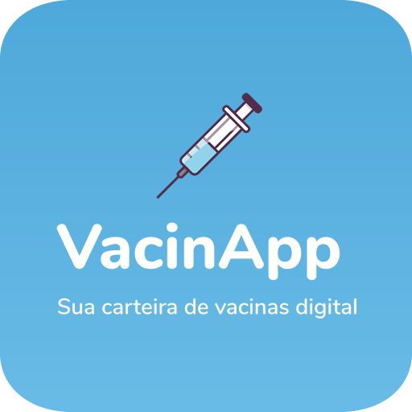

# About VacinApp

Have your vaccination records always handy. With our app you can store all the details about your vaccinations during all periods of your life in an easy way. No more keeping vaccination cards in drawers!

- This API is designed to work with a [mobile application](https://play.google.com/store/apps/details?id=com.vacinapp). Please, [e-mail me](brandaolopes.dev@gmail.com) if you want to contribute.

## Laravel Application

This is a Laravel 6 application.

## Installation

To install this application, you need to have PHP >= 7.2.0 and Composer installed on your machine.

- Clone this repository or download the zip file.
- Navigate to the project directory and run `composer install` to install the dependencies.
- Copy the `.env.example` file to `.env` and fill in your database credentials and other settings.
- Run `php artisan key:generate` to generate an application key.
- Run `php artisan migrate` to create the database tables.
- Run `npm install` to install the front-end dependencies.
- Run `npm run dev` to compile the assets.

## Running the application

To run the application locally, you can use the `php artisan serve` command to start a development server at http://localhost:8000 (please note that default port can be different).

Alternatively, you can configure your web server's document root to be the `public` directory and access the application from your browser.

## Routes

- ### Authorization `Bearer Token`

    - `Token` <token>

- ### Request Headers

    - Accept `application\json`

- ### User's Get Routes

    #### - `/api/users` get data of all users;
    #### - `/api/users/:id` get data of one user (id as parameter);
    #### - `/api/me` get data of logged in user
        Authorization `Bearer Token`
        - `Token` <token>
        Request Headers
        - Accept `application\json`

- ### User's Post Routes

    #### - `/api/user` send data of an user to API (create user)
        Body must content the following fields:
        - name (string, required, max:255)
        - surname (string, required, max:255)
        - email (string, required, unique)
        - password (string, required)
        - cpf (numeric, required, size 11, unique)
        - date of born (YYYY-MM-DD, required)
        - gender (character, [m, f or o], max:1)
        - state (string, max:2)
        - city (string, max:255)

    #### - `/api/login` log-in an user
        Body (form data) must content the following fields:
        - email (string, required, unique)
        - password (string, required)

    #### - `/api/logout` log-out an user
        Authorization `Bearer Token`
        - `Token` <token>
        Request Headers
        - Accept `application\json`

- ### User's Patch Routes

    #### -`/api/user/:id` edit data of an user (id as parameter);
        Body must content the following fields:
        - name (string, required, max:255)
        - surname (string, required, max:255)
        - email (string, required, unique)
        - password (string, required)
        - cpf (numeric, required, size 11, unique)
        - date of born (YYYY-MM-DD, required)
        - gender (character, [m, f or o], max:1)
        - state (string, max:2)
        - city (string, max:255)

- ### User's Delete Route

    #### -`/api/user/:id` delete an user (id as parameter)
        Authorization `Bearer Token`
        - `Token` <token>
        Request Headers
        - Accept `application\json`

- ### Forgot Password Routes

    #### - `/api/password/email` send email address to reset password
        Body must content the following field:
        - email (string, required, unique)

- ### Vaccines' Get Routes
    #### -`/api/vaccines` get data of all vaccines of the logged user
        Authorization `Bearer Token`
        - `Token` <token>
        Request Headers
        - Accept `application\json`

    #### -`/api/vaccines/:id` get data of a vaccine (id as parameter)

- ### Vaccines' Post Route
    #### -`/api/vaccines` send data of a vaccine of the logged user to API
        Body must content the following fields:
        -title (string, required, max:255)
        -description (string, max:255)
        -batch (string, max:255)
        -total_doses_number (numeric, required, min:1, max:10)
        -dose (numeric, required, min:1, max:10)
        -life_stage (enum, [newborn, child, teen, adult or elder])
        -frequency (numeric) *in days
        -created_at (YYYY-MM-DD HH:MM:SS)

- ### Vaccines' Put Route
    #### -`/api/vaccines/:id` edit data of a vaccine (id as parameter)
        Body must content the following fields:
        -title (string, required, max:255)
        -description (string, max:255)
        -batch (string, max:255)
        -total_doses_number (numeric, required, min:1, max:10)
        -dose (numeric, required, min:1, max:10)
        -life_stage (enum, [newborn, child, teen, adult or elder])
        -frequency (numeric) *in days
        -created_at (YYYY-MM-DD HH:MM:SS)

- ### Vaccines' Delete Route
    #### -`/api/vaccines/:id` delete a vaccine (id as parameter)

## Deployment

To deploy the application to your server, you need to follow these steps:

- Upload the project files to your server using FTP or SSH.
- Set the permissions of the `storage` and `bootstrap/cache` directories to be writable by your web server.
- Run `composer install --optimize-autoloader --no-dev` to install the dependencies and optimize the autoloader.
- Run `php artisan config:cache` and `php artisan route:cache` to cache the configuration and routes.
- Run `npm run production` to compile and minify the assets for production.

## License

This application is open-sourced software licensed under the [MIT license](https://opensource.org/licenses/MIT).

## Contributing

Thank you for considering contributing to the VacinApp! If you have any questions, suggestions or issues, please contact us at brandaolopes.dev@gmail.com
